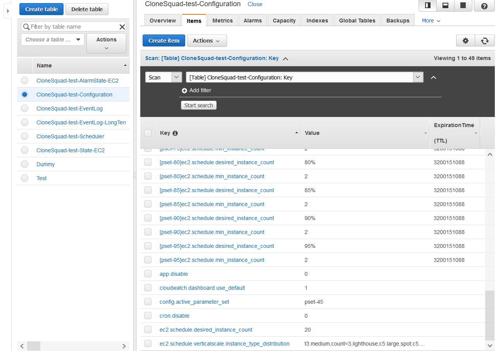

# CloneSquad Configuration reference

> This document is focused on runtime configuration of CloneSquad. See the specific documentation about the 
[CloneSquad deployment configuration](DEPLOYMENT_REFERENCE.md)

## Concepts

CloneSquad uses a multi-layered configuration system using the YAML semantic and format.

Each layer can override configuration defined in below layers.

Layer overrides by order of precedence (highest priority to lowest one):
1) Keys prefixed with '`override:`' string (ex: `override:ec2.schedule.min_instance_count` overrides the value set in `ec2.schedule.min_instance_count`),
2) DynamodDB configuration table [Parameter set](#parameter-sets),
3) DynamodDB configuration table,
4) CloudFormation template parameter '`ConfigurationURLs`' pointing to a list of URLs (see supported protocoles below),
5) YAML URLs listed in configuration key [`config.loaded_files`](#configloaded_files),
6) Built-in Defaults

URLs can use the following protocols: ["s3", "http", "https", "internal"]. 
* `internal:` references a file contained inside the Lambda filesystem,
* `s3://` references a file located into S3 with support for SigV4 authentication.

Note: If an URL resource fails to load, a warning is generated but it is safely ignored by the configuration subsystem to avoid
a service malfunction. Users needs to take into account this expected behavior.

### Using `override:` syntax

`override:` keyword can be placed in front of a key name to override the current value of this key.

The following YAML snippet demoes how [`ec2.schedule.min_instance_count`](#ec2schedulemin_instance_count) value is overriden using this keyword.

Ex:

	# In this setup, ec2.schedule.min_instance_count will be valued as '100%' due to the override.
	override:ec2.schedule.min_instance_count: 100%
	ec2.schedule.min_instance_count: 2

This keyword is valuable to implement maintenance use-cases easily. For instance, if you need to perform patch management of 
CloneSquad managed instances, you can set the key [`override:ec2.schedule.min_instance_count`](#ec2schedulemin_instance_count) to `100%` to start all instances
in a fleet without to care about the current value of this key.

Combined with the TTL feature of the [CloneSquad API gateway](INTERACTING.md#api-configuration-1), you can also define an override for only a specified amount of time (ex: one hour) before the normal configuration
takes place again.

### Customizing the Lambda package

The configuration subsystem allows reference to external URLs located in S3 or other Web servers. Some may have
concerns that it creates dependencies to resources that could be unreachable under a *Large Scale Event* condition 
(Ex: AZ unavailability).
In order to mitigate this concern, users can customize the Lambda package to embed their own configuration resources
and so, be able to access them with the reliable `internal:` protocol scheme.

To do so, create a ZIP file containing your YAML files and push it to an S3 Bucket accessible to CloudFormation. 

> Tip: In the ZIP file, create a file named 'custom.config.yaml' that will be read automatically at each scheduling Lambda function launch (every 20s by default).

The [Cloudformation template](../template.yaml) contains the parameter `CustomizationZipParameters` to inject this customization ZIP file at
deployment time.
* Format: <S3_bucket_name>:<S3_key_path_to_Zip_file>


### Parameter sets

The parameter set mechanism allows dynamic configuration override. It is mainly used to enable a whole
*named* bunch of configuration items with the single switch key [`config.active_parameter_set`](#configactive_parameter_set).

When set, the configuration subsystem is looking for a parameter set with the specified name.

A parameter set is a YAML dict (or using a special syntax in DynamoDB).

Ex:

	###
	# Define a parameter set key aside non-paramater set keys.
	ec2.schedule.min_instance_count: 2
	my-pset:
		ec2.schedule.min_instance_count: 3
		ec2.schedule.desired_instance_count: 50%
	# Activate the parameter set named 'my-pset' that will override matching non-parameter set keys.
	config.active_parameter_set: my-pset   

This example shows a dynamic override of the [`ec2.schedule.min_instance_count`](#ec2schedulemin_instance_count) and
[`ec2.schedule.desired_instance_count`](#ec2scheduledesired_instance_count) keys. The configuration subsystem will evaluate the 
key [`ec2.schedule.min_instance_count`](#ec2.schedule.min_instance_count) to a value of 3 (instead of 2) when [`config.active_parameter_set`](#configactive_parameter_set) is set to
'my-pset' value.

This mechanism is used in the demonstration [demo-scheduled-events](../examples/environments/demo-scheduled-events/). 
The CloneSquad scheduler is used to set the [`config.active_parameter_set`](#configactive_parameter_set) to temporarily activate a set of 
scaling parameters.

In the Configuration DynamoDB table, a specific syntax is used to describe key membership to a parameter set.



> Note: Every DynamoDB configuration keys starting by a character `#` are silently ignored (comment syntax).

## Configuration keys


### app.disable
Default Value: `0`   
Format       :  [Bool](#Bool)

Flag to disable Main Lambda function responsible to start/stop EC2 instances. 

It disables completly CloneSquad. While disabled, the Lambda will continue to be started every minute to test
if this flag changed its status and allow normal operation again.


### app.run_period
Default Value: `seconds=20`   
Format       :  [Duration](#Duration)

Period when the Main scheduling Lambda function is run.

The smaller, the more accurate and reactive is CloneSquad. The bigger, the cheaper is CloneSquad to run itself (Lambda executions,
Cloudwatch GetMetricData, DynamoDB queries...)
               


### cloudwatch.alarm00.configuration_url
Default Value: ``   
Format       :  [MetaString](#MetaString)

Alarm specification to track for scaling decisions.

    Ex: internal:ec2.scaleup.alarm-cpu-gt-75pc.yaml,Points=1001,BaselineThreshold=30.0

See [Alarm specification documentation](ALARMS_REFERENCE.md)  for more details.
            


### cloudwatch.alarm01.configuration_url
Default Value: ``   
Format       :  [MetaString](#MetaString)

See `cloudwatch.alarm00.configuration_url`.
                


### cloudwatch.alarm02.configuration_url
Default Value: ``   
Format       :  [MetaString](#MetaString)

See `cloudwatch.alarm00.configuration_url`.
                


### cloudwatch.alarm03.configuration_url
Default Value: ``   
Format       :  [MetaString](#MetaString)

See `cloudwatch.alarm00.configuration_url`.
                


### cloudwatch.alarm04.configuration_url
Default Value: ``   
Format       :  [MetaString](#MetaString)

See `cloudwatch.alarm00.configuration_url`.
                


### cloudwatch.alarm05.configuration_url
Default Value: ``   
Format       :  [MetaString](#MetaString)

See `cloudwatch.alarm00.configuration_url`.
                


### cloudwatch.dashboard.use_default
Default Value: `1`   
Format       :  [Bool](#Bool)

Enable or disable the Cloudwatch dashboard for CloneSquad.

The dashboard is enabled by default.
                        


### cloudwatch.metrics.excluded
Default Value: ``   
Format       :  [StringList](#StringList)

List of metric pattern names to not send to Cloudwatch

This configuration key is used to do Cost optimization by filtering which CloneSquad Metrics are sent to Cloudwatch.
It support regex patterns.

> Ex: Subfleet.*;NbOfBouncedInstances

                        


### cloudwatch.metrics.time_for_full_metric_refresh
Default Value: `minutes=1,seconds=30`   
Format       :  [Duration](#Duration)

The total period for a complete refresh of EC2 Instance metrics

This parameter is a way to reduce Cloudwatch cost induced by GetMetricData API calls. It defines indirectly how many alarm metrics
will be polled in a single Main Lambda execution. A dedicated algorithm is used to extrapolate missing data based
on previous GetMetricData API calls.

Reducing this value increase the accuracy of the scaling criteria and so, the reactivity of CloneSquad to a sudden burst of activity load but at the
expense of Cloudwatch.GetMetricData API cost.

This parameter does not influence the polling of user supplied alarms that are always polled at each run.
                        


### cloudwatch.subfleet.use_dashboard
Default Value: `1`   
Format       :  [Bool](#Bool)

Enable or disabled the dashboard dedicated to Subfleets.

By default, the dashboard is enabled.

> Note: The dashboard is configured only if there is at least one Subfleet with detailed metrics.
                 


### config.active_parameter_set
Default Value: ``   
Format       :  [String](#String)

Defines the parameter set to activate.

See [Parameter sets](#parameter-sets) documentation.
                 


### config.dump_configuration
Default Value: `0`   
Format       :  [Bool](#Bool)

Display all relevant configuration parameters in CloudWatch logs.

    Used for debugging purpose.
                 


### config.ignored_warning_keys
Default Value: ``   
Format       :  [StringList](#StringList)

A list of config keys that are generating a warning on usage, to disable them.

Typical usage is to avoid the 'WARNING' Cloudwatch Alarm to trigger when using a non-Stable configuration key.

    Ex: ec2.schedule.key1;ec2.schedule.key2

    Remember that using non-stable configuration keys, is creating risk as semantic and/or existence could change 
    from CloneSquad version to version!
            


### config.loaded_files
Default Value: ``   
Format       :  [StringList](#StringList)

A semi-column separated list of URL to load as configuration.

Upon startup, CloneSquad will load the listed files in sequence and stack them allowing override between layers.

Internally, 2 files are systematically loaded: 'internal:predefined.config.yaml' and 'internal:custom.config.yaml'. Users that intend to embed
customization directly inside the Lambda delivery should override file 'internal:custom.config.yaml' with their own configuration. See 
[Customizing the Lambda package](#customizing-the-lambda-package).

This key is evaluated again after each URL parsing meaning that a layer can redefine the 'config.loaded_files' to load further
YAML files.
                 


### ec2.az.evict_instances_when_az_faulty
Default Value: `0`   
Format       :  [Bool](#Bool)

Defines if instances running in a AZ with issues must be considered 'unavailable'

By Default, instances running in an AZ reported with issues are left untouched and these instances will only be evicted if
their invidual healthchecks fail or on scalein events.

Settting this parameter to 1 will force Clonesquad to consider all the instances running in faulty AZ as 'unavailable' and so
forcing their immediate replacement in healthy AZs in the region. 
                 


### ec2.az.unavailable_list
Default Value: ``   
Format       :  [StringList](#StringList)

List of Availability Zone names (ex: *eu-west-3c*) or AZ Ids (ex: *euw3-az1*).

Typical usage is to force a fleet to consider one or more AZs as unavailable (AZ eviction). The autoscaler will then refuse to schedule
new instances on these AZs. Existing instances in those AZs are left unchanged but on scalein condition will be 
shutdown in priority (see [`ec2.az.evict_instances_when_az_faulty`](#ec2azevict_instances_when_az_faulty) to change this behavior). 
This setting is global and affects instances both in the Main fleet and the Subfleets.

This setting can be used during an AWS LSE (Large Scale Event) to manually define that an AZ is unavailable.

> Note: CloneSquad also uses the EC2.describe_availability_zones() API to discover dynamically LSE events. So, setting directly this key
should not be needed in most cases.

Please notice that, once an AZ is enabled again (either manually or automatically), instance fleet WON'T be rebalanced automatically:
* If Instance bouncing is enabled, the fleet will be progressively rebalanced (convergence time will depend on the instance bouncing setting)
* If instance bouncing is not configured, user can force a rebalancing by switching temporarily the fleet to `100%` during few minutes 
(with [`ec2.schedule.desired_instance_count`](#ec2scheduledesired_instance_count) sets temporarily to `100%`) and switch back to the 
original value.

                     


### ec2.instance.status.override_url
Default Value: ``   
Format       :  [String](#String)

Url pointing to a YAML file overriding EC2.describe_instance_status() instance states.

CloneSquad can optionaly load a YAML file containing EC2 instance status override.

The format is a dict of 'InstanceId' containing another dict of metadata:

```yaml
---
i-0ef23917a58368c89:
    status: ok
i-0ad73bbc09cb68f81:
    status: unhealthy
```

The status item can contain any of valid values returned by `EC2.describe_instance_status()["InstanceStatus"]["Status"]`.
The valid values are ["ok", "impaired", "insufficient-data", "not-applicable", "initializing", "unhealthy"].    

**Please notice the special 'unhealthy' value that is a CloneSquad extension:** This value can be injected to force 
an instance to be considered as unhealthy by the scheduler. It can be useful to debug/simulate a failure of a 
specific instance or to inject 'unhealthy' status coming from a non-TargetGroup source (ex: when CloneSquad is used
without any TargetGroup but another external health instance source exists).

                    


### ec2.schedule.bounce_delay
Default Value: `minutes=0`   
Format       :  [Duration](#Duration)

Max instance running time before bouncing.

By default, the bouncing algorithm is disabled. When this key is defined with a duration greated than 0 second, the fleet instances
are monitored for maximum age. Ex: 'days=2' means that, a instance running for more than 2 days will be bounced implying 
a fresh one will be started before the too old one is going to be stoppped.

Activating bouncing algorithm is a good way to keep the fleet correctly balanced from an AZ spread PoV and, if vertical scaling
is enabled, from an instance type distribution PoV.

> If your application supports it, activate instance bouncing.

                         


### ec2.schedule.burstable_instance.max_cpu_crediting_instances
Default Value: `50%`   
Format       :  [IntegerOrPercentage](#IntegerOrPercentage)

Maximum number of instances that could be in the CPU crediting state at the same time.

Setting this parameter to 100% could lead to fleet availability issues and so is not recommended. Under scaleout stress
condition, CloneSquad will automatically stop and restart instances in CPU Crediting state but it may take time (up to 3 mins). 
                     
    If you need to increase this value, it may mean that your burstable instance types are too 
    small for your workload. Consider upgrading instance types instead.
                     


### ec2.schedule.burstable_instance.max_cpucrediting_time
Default Value: `hours=12`   
Format       :  [Duration](#Duration)

Maximum duration that an instance can spent in the 'CPU Crediting' state.

This parameter is a safety guard to avoid a burstable instance with a faulty high-cpu condition to induce 'unlimited' credit
over spending for ever.
                        


### ec2.schedule.burstable_instance.min_cpu_credit_required
Default Value: `30%`   
Format       :  [IntegerOrPercentage](#IntegerOrPercentage)

The minimun amount CPU Credit that a burstable instance should have before to be shutdown.

This value is used by the 'CPU Crediting' algorithm to determine when a Burstable instance has gained enough credits to leave the
CPU Crediting mode and be shutdown.

When specified in percentage, 100% represents the ['Maximum earned credits than be accrued in a single day'](https://docs.aws.amazon.com/AWSEC2/latest/UserGuide/burstable-credits-baseline-concepts.html).

    Ex: `30%` for a t3.medium means a minimum cpu credit of `0.3 * 576 = 172`

                         


### ec2.schedule.burstable_instance.preserve_accrued_cpu_credit
Default Value: `0`   
Format       :  [Bool](#Bool)

Enable a weekly wakeup of burstable instances ["t3","t4"]

This flag enables an automatic wakeup of stopped instances before the one-week limit that would mean accrued CPU Credit loss.
                         


### ec2.schedule.desired_instance_count
Default Value: `-1`   
Format       :  [IntegerOrPercentage](#IntegerOrPercentage)

If set to -1, the autoscaler controls freely the number of running instances. Set to a value different than -1,
the autoscaler is disabled and this value defines the number of serving (=running & healthy) instances to maintain at all time.
The [`ec2.schedule.min_instance_count`](#ec2schedulemin_instance_count) is still authoritative and the 
[`ec2.schedule.desired_instance_count`](#ec2scheduledesired_instance_count) parameter cannot bring
the serving fleet size below this hard lower limit. 

A typical usage for this key is to set it to `100%` to temporarily force all the instances to run at the same time to perform mutable maintenance
(System and/or SW patching).

> Tip: Setting this key to the special `100%` value has also the side effect to disable all instance health check management and so ensure the whole fleet running 
at its maximum size in a stable manner (i.e. even if there are impaired/unhealthy instances in the fleet, they won't be restarted automatically).

> **Important tip related to LightHouse instances**:  In a maintenance use-case, users may require to have all instances **including LightHouse ones** up and running; setting both [`ec2.schedule.desired_instance_count`](#ec2scheduledesired_instance_count) and [`ec2.schedule.min_instance_count`](#ec2schedulemin_instance_count) to the string value `100%` will start ALL instances.
                     


### ec2.schedule.disable
Default Value: `0`   
Format       :  [Bool](#Bool)

Disable all scale or automations algorithm in the Main fleet. 

Setting this parameter to '1' disables all scaling and automation algorithms in the Main fleet. While set, all Main fleet instances can be freely started 
and stopped by the users without CloneSquad trying to manage them. 

Note: It is semantically similar to the value `undefined` in subfleet configuration key [`subfleet.{SubfleetName}.state`](#subfleetsubfleetnamestate).
                    


### ec2.schedule.draining.instance_cooldown
Default Value: `minutes=2`   
Format       :  [Duration](#Duration)

Minimum time to spend in the 'draining' state.

If SSM support is enabled with [`ssm.feature.events.ec2.instance_ready_for_shutdown`](#ssmfeatureeventsec2instance_ready_for_shutdown), a script located in the drained instance is executed to ensure that the instance is ready for shutdown even after the specified duration is exhausted. If this script returns non-zero code, the shutdown is postponed for a maximum duration defined in [`ssm.feature.events.ec2.instance_ready_for_shutdown.max_shutdown_delay`](#ssmfeatureeventsec2instance_ready_for_shutdownmax_shutdown_delay).
                


### ec2.schedule.min_instance_count
Default Value: `0`   
Format       :  [PositiveInteger](#PositiveInteger)

Minimum number of healthy serving instances. 

CloneSquad will ensure that at least this number of instances
are runnning at a given time. A serving instance has passed all the health checks (if part of Target group) and is not detected with
system issues.

                 


### ec2.schedule.scalein.disable
Default Value: `0`   
Format       :  [Bool](#Bool)

Disable the scalein part of the autoscaler.

    Setting this value to 1 makes the autoscaler scaleout only.
                     


### ec2.schedule.scalein.instance_upfront_count
Default Value: `0`   
Format       :  [Integer](#Integer)

Number of instances to stop upfront of a new scalein condition

When autoscaling is enabled, the autoscaler algorithm compute when to drain and stop a new instance using its internal time-based and point-based
algorithm. This parameter is used to bypass this algorithm (only at start of a scalein sequence) and make it appears more responsive
by draining immediatly the specified amount of instances. 

> It is not recommended to put a big value for this parameter (it is better 
to let the autoscaler algorithm do its smoother job instead)
                         


### ec2.schedule.scalein.period
Default Value: `minutes=10`   
Format       :  [Duration](#Duration)

Same than `ec2.schedule.scaleout.period` but for the scalein direction.

Must be a greater than `0` Integer.

                     


### ec2.schedule.scalein.rate
Default Value: `3`   
Format       :  [Integer](#Integer)

Same than `ec2.schedule.scaleout.rate` but for the scalein direction.

Must be a greater than `0` Integer.

                     


### ec2.schedule.scaleout.disable
Default Value: `0`   
Format       :  [Bool](#Bool)

Disable the scaleout part of the autoscaler.

    Setting this value to 1 makes the autoscaler scalein only.
                    


### ec2.schedule.scaleout.instance_upfront_count
Default Value: `1`   
Format       :  [Integer](#Integer)

Number of instances to start upfront of a new scaleout condition.

When autoscaling is enabled, the autoscaler algorithm compute when to start a new instance using its internal time-based and point-based
algorithm. This parameter is used to bypass this algorithm (only at start of a scaleout sequence) and make it appears more responsive
by starting immediatly the specified amount of instances. 

> It is not recommended to put a big value for this parameter (it is better 
to let the autoscaler algorithm do its smoother job instead)
                     


### ec2.schedule.scaleout.period
Default Value: `minutes=10`   
Format       :  [Duration](#Duration)

Period of scaling assessment. 

This parameter is strongly linked with [`ec2.scheduler.scaleout.rate`](#ec2schedulerscaleoutrate) and is 
used by the scaling algorithm as a devider to determine the fleet growth rate under scalout condition.
                     


### ec2.schedule.scaleout.rate
Default Value: `5`   
Format       :  [PositiveInteger](#PositiveInteger)

Number of instances to start per period.   

This core parameter is used by the autoscaler to compute when to 
start a new instance under a scaleout condition. By default, it is set to 5 instances per period (see [`ec2.schedule.scaleout.period`](#ec2schedulescaleoutperiod)) that 
is quite a slow growth rate. This number can be increased to grow faster the running fleet under scale out condition.

Increasing too much this parameter makes the autoscaler very reactive and can lead to over-reaction inducing unexpected costs:
A big value can be sustainable when [CloudWatch High-Precision alarms](https://aws.amazon.com/fr/about-aws/whats-new/2017/07/amazon-cloudwatch-introduces-high-resolution-custom-metrics-and-alarms/)
are used allowing the autoscaler to get very quickly a 
feedback loop of the impact of added instances. With standard alarms from the AWS namespace, precision is at best 1 minute and 
the associated CloudWatch metrics can't react fast enough to inform the algorithm with accurate data.

> **Do not use big value there when using Cloudwatch Alarms with 1 min ou 5 mins precision.**
                     


### ec2.schedule.start.warmup_delay
Default Value: `minutes=3`   
Format       :  [Duration](#Duration)

Minimum delay for node readiness.

After an instance start, CloneSquad will consider it in 'initializing' state for the specified minimum amount of time.

When at least one instance is in 'initializing' state in a fleet, no other instance can be placed in `draining` state meanwhile:
This delay is meant to let new instances to succeed their initialization.

If an application takes a long time to be ready, it can be useful to increase this value.
                 


### ec2.schedule.verticalscale.instance_type_distribution
Default Value: ``   
Format       :  [MetaStringList](#MetaStringList)

Policy for vertical scaling. 

This setting is a core critical one and defines the vertical scaling policy.
This parameter controls how the vertical scaler will prioritize usage and on-the-go instance type modifications.

By default, no vertical scaling is configured meaning all instances whatever their instance type or launch model (Spot vs
On-Demand) are handled the same way. 
                         
This parameter is a [MetaStringList](#MetaStringList)

    Ex: t3.medium,lighthouse;c5.large,spot;c5.large;c5.xlarge

Please consider reading [detailed decumentation about vertical scaling](SCALING.md#vertical-scaling) to ensure proper use.
                         


### ec2.schedule.verticalscale.lighthouse_disable
Default Value: `0`   
Format       :  [Bool](#Bool)

Completly disable the LightHouse instance algorithm. 

As consequence, all instances matching the 'LightHouse' directive won't be scheduled.

Typical usage for this key is to ensure the fleet always run with best performing instances. As a example, Users could consider to use this 
key in combination with the instance scheduler to force the fleet to be 'LightHouse' instance free on peak load hours.
                         


### notify.event.longterm.max_records
Default Value: `50`   
Format       :  [Integer](#Integer)

Maximum records to hold in the Event-LongTerm DynamodDB table

Setting this value to 0, disable logging to the LongTerm event table.


### notify.event.longterm.ttl
Default Value: `days=5`   
Format       :  [Duration](#Duration)

Retention time for Long-Term DynamoDB entries.

This table is used to deep-dive analysis of noticeable events encountered by a CloneSquad deployment. It is mainly used to
improve CloneSquad over time by allowing easy sharing of essential data for remote debugging.
               


### rds.enable
Default Value: `0`   
Format       :  [Bool](#Bool)

Enable management of RDS databases.

DEPRECATED. (Now automatic detection of RDS resources is implemented.)
                


### ssm.enable
Default Value: `0`   
Format       :  [Bool](#Bool)

Enable globally support for AWS System Manager by CloneSquad.

CloneSquad can leverage AWS SSM to take into account Maintenance Windows and use SSM RunCommand to execute status probe scripts located in managed instances.
            


### ssm.feature.events.ec2.instance_ready_for_operation
Default Value: `0`   
Format       :  [Bool](#Bool)

Ensure an instance go out from 'initializing' state based on an instance script returns code.

This enables support for direct sensing of instance **serving** readiness based on the return code of a script located in each EC2 instances. CloneSquad never stops an instance in the 'initializing' state. This state is normally automatically left after [`ec2.schedule.start.warmup_delay`](#ec2schedulestartwarmup_delay) seconds: When this setting is set, an SSM command is sent to each instance and call a script to get a direct ack that an instance can left the 'initializing' state.

* If `/etc/cs-ssm/instance-ready-for-operation` is present, it is executed with the SSM agent daemon user rights: If the script returns a NON-zero code, Clonesquad will postpone the instance go-out from 'initializing' state and will call this script again after 2 * [ `app.run_period`](#apprun_period) seconds...
* If `/etc/cs-ssm/instance-ready-for-operation` is NOT present, the instance leaves the 'initializing' state immediatly after 'warmup delay'..

> This setting is taken into account only if [`ssm.enable`](#ssmenable) is set to 1.
            


### ssm.feature.events.ec2.instance_ready_for_operation.max_initializing_time
Default Value: `hours=1`   
Format       :  [Duration](#Duration)

Max time that an instance can spend in 'initializing' state.

When [`ssm.feature.events.ec2.instance_ready_for_operation`](#ssmfeatureec2instance_ready_for_operation) is set, this setting defines the maximum duration that CloneSquas will attempt to get a status 'ready-for-operation' for a specific instance through SSM RunCommand calls and execution of the `/etc/cs-ssm/instance-ready-for-operation` script.
            


### ssm.feature.events.ec2.instance_ready_for_shutdown
Default Value: `0`   
Format       :  [Bool](#Bool)

Ensure instance shutdown readiness with /etc/cs-ssm/instance-ready-for-shutdown script on SSM managed instances."

This enables support for direct sensing of instance shutdown readiness based on the return code of a script located in each EC2 instances. When set to 1, CloneSquad sends a SSM RunCommand to a managed instance candidate prior to shutdown: 
* If `/etc/cs-ssm/instance-ready-for-shutdown` is present, it is executed with the SSM agent daemon user rights: If the script returns a NON-zero code, Clonesquad will postpone the instance shutdown and will call this script again after 2 * [ `app.run_period`](#apprun_period) seconds...
* If `/etc/cs-ssm/instance-ready-for-shutdown` is NOT present, immediate shutdown readyness is assumed.

> This setting is taken into account only if [`ssm.enable`](#ssmenable) is set to 1.
            


### ssm.feature.events.ec2.instance_ready_for_shutdown.max_shutdown_delay
Default Value: `hours=1`   
Format       :  [Duration](#Duration)

 Maximum time to spend waiting for SSM based ready-for-shutdown status.

When SSM support is enabled with [`ssm.feature.events.ec2.instance_ready_for_operation`](#ssmfeatureec2instance_ready_for_operation), instances may notify CloneSquad when they are ready for shutdown. This setting defines
the maximum time spent by CloneSquad to receive this signal before to forcibly shutdown the instance.
                


### ssm.feature.events.ec2.maintenance_window_period
Default Value: `0`   
Format       :  [Bool](#Bool)

Enable/Disable sending Enter/Exit Maintenance Window period events to instances.

This enables event notification support of instances when they enter or exit a SSM Maintenance Window. When set to 1, CloneSquad sends a SSM RunCommand to run the script `/etc/cs-ssm/(enter|exit)-maintenance-window-period` script located in each instances. The event is repeasted until the script returns a zero-code. If the script doesn't exist on an instance, the event is sent only once.

> This setting is taken into account only if [`ssm.enable`](#ssmenable) is set to 1.
            


### ssm.feature.events.ec2.scaling_state_changes
Default Value: `0`   
Format       :  [Bool](#Bool)

Call a script in instance when the instance scaling state changes.

When this toggle set, the script `/etc/cs-ssm/instance-scaling-state-change` located into managed instances, is called to notify about a scaling status change. 
Currently, only `draining` and `bounced` events are sent (`bounced`is sent only if the instance bouncing feature is activated). For example, if an instance enters the `draining` state because CloneSquad wants to shutdown it, this event is called.

* If the script doesn't exists, the event is sent only once,
* If the script returns a non-zero code, the event will be repeated.

> Note: This event differs from [`ssm.feature.events.ec2.instance_ready_for_shutdown`](#ssmfeatureeventsec2instance_ready_for_shutdown) one as it is only meant to inform the instance about a status change. The [`ssm.feature.events.ec2.instance_ready_for_shutdown`](#ssmfeatureeventsec2instance_ready_for_shutdown) event is a request toward the instance asking for an approval to shutdown.

            


### ssm.feature.events.ec2.scaling_state_changes.draining.connection_refused_tcp_ports
Default Value: ``   
Format       :  [StringList](#StringList)

On `draining` state, specified ports are blocked and so forbid new TCP connections (i.e. *Connection refused* message).

This features installs, **on `draining` time**, temporary iptables chain and rules denying new TCP connections to the specified port list.
This is useful, for example, to break a healthcheck life line as soon as an instance enters the `draining` state: It is especially useful when non-ELB LoadBalancers are used and CloneSquad does not know how to tell these loadbalancers that no more traffic needs to be sent to a drained instance. As it blocks only new TCP connections, currently active connections can terminate gracefully during the draining period.

> When instances are served only by CloneSquad managed ELB(s), there is no need to use this feature as CloneSquad will unregister the targets as soon as placed in `draining`state.

By default, no blocked port list is specified, so no iptables call is performed on the instance.
            


### ssm.feature.events.ec2.scaling_state_changes.draining.{SubfleeName}.connection_refused_tcp_ports
Default Value: ``   
Format       :  [StringList](#StringList)

Defines the blocked TCP port list for the specified fleet.

This setting overrides the value defined in [`ssm.feature.events.ec2.scaling_state_changes.draining.connection_refused_tcp_ports`](#ssmfeatureeventsec2scaling_state_changesdrainingconnection_refused_tcp_ports) for the specified fleet.

> Use `__main__` to designate the main fleet.


### ssm.feature.maintenance_window
Default Value: `0`   
Format       :  [Bool](#Bool)

Defines if SSM maintenance window support is activated.

> This setting is taken into account only if [`ssm.enable`](#ssmenable) is set to 1.
            


### ssm.feature.maintenance_window.start_ahead
Default Value: `minutes=15`   
Format       :  [Duration](#Duration)

Start instances this specified time ahead of the next Maintenance Window.

In order to ensure that instances are up and ready when a SSM Maintenance Window starts, they are started in advance of the 'NextExecutionTime' defined in the SSM maintenance window object.
            


### ssm.feature.maintenance_window.subfleet.{SubfleetName}.force_running
Default Value: `1`   
Format       :  [Bool](#Bool)

Defines if a subfleet is forcibly set to 'running' when a maintenance window is actice.
        
By default, all the subfleets is woken up by a maintenance window ([`subfleet.{SubfleetName}.state`](#subfleetsubfleetnamestate) is temprarily forced to `running`).
            


### subfleet.{SubfleetName}.ec2.schedule.burstable_instance.max_cpu_crediting_instances
Default Value: `0%`   
Format       :  [IntegerOrPercentage](#IntegerOrPercentage)

Define the maximum number of EC2 instances that can be in CPU Crediting state at the same time in the designated subfleet.

Follow the same semantic and usage than [`ec2.schedule.burstable_instance.max_cpu_crediting_instances`](#ec2scheduleburstable_instancemax_cpu_crediting_instances).
                 


### subfleet.{SubfleetName}.ec2.schedule.desired_instance_count
Default Value: `100%`   
Format       :  [IntegerOrPercentage](#IntegerOrPercentage)

Define the number of EC2 instances to start when a subfleet is in a 'running' state.

**Note:** `-1` is an invalid value (and so do not mean 'autoscaling' like in [`ec2.schedule.desired_instance_count`](#ec2scheduledesired_instance_count)).

> This parameter has no effect if [`subfleet.subfleetname.state`](#subfleetsubfleetnamestate) is set to a value different than `running`.
                 


### subfleet.{SubfleetName}.ec2.schedule.metrics.enable
Default Value: `1`   
Format       :  [Bool](#Bool)

Enable detailed metrics for the subfleet {SubfleetName}.

The following additional metrics are generated:
* Subfleet.EC2.Size,
* Subfleet.EC2.RunningInstances,
* Subfleet.EC2.DrainingInstances.

These metrics are associated to a dimension specifying the subfleet name and are so different from the metrics with similar names from
the autoscaled fleet.

                 


### subfleet.{SubfleetName}.ec2.schedule.min_instance_count
Default Value: `0`   
Format       :  [IntegerOrPercentage](#IntegerOrPercentage)

Define the minimum number of EC2 instances to keep up when a subfleet is in a 'running' state.

> This parameter has no effect if [`subfleet.subfleetname.state`](#subfleetsubfleetnamestate) is set to a value different than `running`.
                 


### subfleet.{SubfleetName}.ec2.schedule.verticalscale.instance_type_distribution
Default Value: `.*,spot;.*`   
Format       :  [MetaStringList](#MetaStringList)

Define the vertical policy of the subfleet.

It has a similar semantic than [`ec2.schedule.verticalscale.instance_type_distribution`](#ec2scheduleverticalscaleinstance_type_distribution) except
that it does not support LightHouse instance specifications.

**Due to the default value `.*,spot;.*`, by default, Spot instances are always scheduled first in a subfleet!** This can be changed by the user.

> This parameter has no effect if [`subfleet.subfleetname.state`](#subfleetsubfleetnamestate) is set to a value different than `running`.
                 


### subfleet.{SubfleetName}.state
Default Value: `undefined`   
Format       :  [String](#String)

Define the status of the subfleet named {SubfleetName}.

Can be one the following values ['`stopped`', '`undefined`', '`running`'].

A subfleet can contain EC2 instances but also RDS and TransferFamilies tagged instances.

Note: **When subfleet name is `__all__`, the key is overriden in all subfleets.**
                 


### transferfamily.enable
Default Value: `0`   
Format       :  [Bool](#Bool)

Enable management of TransferFamily services.

DEPRECATED. (Now automatic detection of TransferFamilty services is implemented).
                


## Configuration key formats

### Duration

A duration specification expressed in 2 possible ways:
* An [Integer](#Integer) representing a number of seconds,
* A [MetaString](#MetaString) following the meta keys as defined for the [timedelta object](https://docs.python.org/2/library/datetime.html#datetime.timedelta)

	Ex: `days=1,minutes=15,seconds=20` means 1 day + 15 minutes + 20 seconds

### MetaString

A way to represent a string and an associated dictionary of metadata in a one-liner format.

	Ex: <string_value>,<key1=val1>,<key2=val2>,<key3>

* Omitting the value part of a meta key imply the value 'True'
* If `string_value` has to contain a comma, it has to be escaped with a `\`

### MetaStringList

A list of [MetaString](#MetaString) separated by semi-colomn.

	Ex: <string_value1>,<key1_1=val1>,<key1_2=val2>,<key1_3>;<string_value2>,<key2_1=val2_1>

* Omitting the value part of a meta key imply the value 'True'
* If `string_valueX` has to contain a comma or a semi-column, it has to be escaped with a `\`

### StringList

A list of [String](#String) seperated by semi-column.

Currently, it is managed as a [MetaStringList](#MetaStringList) internally so StringList is an alias to
MetaStringList.

It may change in the future so do not specify meta data in keys flagged as [StringList](#StringList)

### IntegerOrPercentage

A [Integer](#Integer) value or a Percentage.

	Ex: `1`or `30%`

### String

A string...

### Integer

A number without fractional part (Ex: -1, 0, 1, 2... etc...)

### PositiveInteger

A positive [Integer](#Integer) including the `0`value.

### Bool

A boolean value represented with an [Integer](#Integer).

`0` means `False`. Other values mean `True`.


