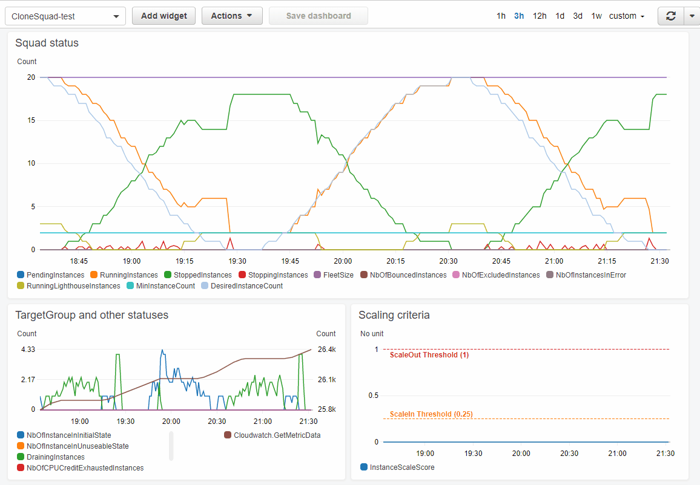
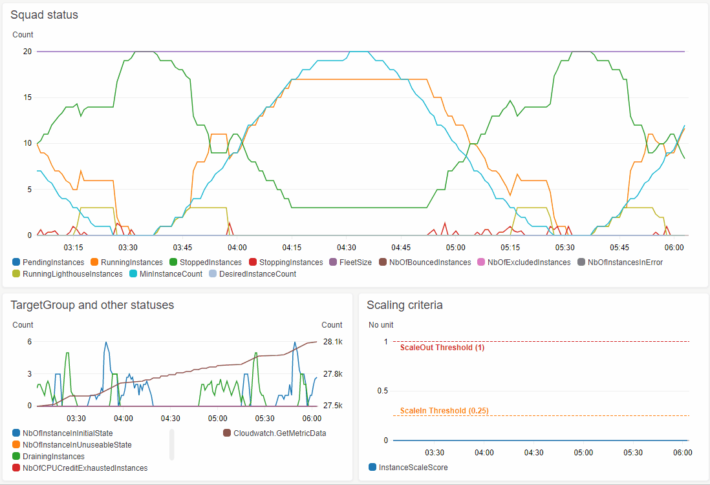

# Scheduled Events demo

This demonstration implements a scheduling of instance counts following a Sinus wave over 2 hours.

It contains multiple variants:
1) With and without [Parameter set](../../../docs/CONFIGURATION_REFERENCE.md#parameter-sets) usage,
2) [`ec2.schedule.min_instance_count`](../../../docs/CONFIGURATION_REFERENCE.md#ec2schedulemin_instance_count) or [`ec2.schedule.desired_instance_count`](../../../docs/CONFIGURATION_REFERENCE.md#ec2scheduledesired_instance_count) variation.

This demonstration allows to see graphically the CloneSquad behavior while these parameters
vary over time.

Ex: Scheduling a Sinus wave (with parameter set mechanism).

```shell
GroupName=<your_group_name>
# Load the parameter set definitions into the DynamodDB configuration table
${CLONESQUAD_DIR}/tools/cs-kvtable CloneSquad-${GroupName}-Configuration import --ttl=days=1 <2hr-with-parameterset-config-desired_instance_count-configfile.yaml
# Load scheduler cron entries in the Scheduler DynamodDB table
${CLONESQUAD_DIR}/tools/cs-kvtable CloneSquad-${GroupName}-Scheduler import --ttl=days=1 <2hr-with-parameterset-config-desired_instance_count-cronfile.yaml
# Note: The optional --ttl=days=1 means that the demo will auto destroy after one day
```

It is recommended to play the demo while managing instances created by the [demo-instance-fleet](../demo-instance-fleet/) with or without
'LightHouse' mode enabled. It is a good way to understand the various behaviors of CloneSquad.

Generated dashboard output for [`ec2.schedule.desired_instance_count`](../../../docs/CONFIGURATION_REFERENCE.md#ec2scheduledesired_instance_count) demo variant:



Generated dashboard output for [`ec2.schedule.min_instance_count`](../../../docs/CONFIGURATION_REFERENCE.md#ec2schedulemin_instance_count) demo variant:



Please notice some significant facts with these graphs:
* The condition to start 'LightHouse' instances are 1) low activity 2) or [`ec2.schedule.desired_instance_count`](../../../docs/CONFIGURATION_REFERENCE.md#ec2scheduledesired_instance_count) set at a very high value (see first demo graph on this page).
In the [`ec2.schedule.min_instance_count`](../../../docs/CONFIGURATION_REFERENCE.md#ec2schedulemin_instance_count) demo graph, we clearly see that LighHouse instances
did not start even [`ec2.scheduler.min_instance_count`](../../../docs/CONFIGURATION_REFERENCE.md#ec2schedulermin_instance_count) is set at 100%. This behavior will also be seen while in scaleout condition.
* In both demonstrations, we can observe that LightHouse instances are restarted progressively while the expected amount of instances fall to a low value. It will
be also seen with scalein/scaleout condition.

## Static fleet flip-flop demo

Static subfleet are not autoscaled resources but are managed in a on/off manner in a very simple way. Static subfleet is provided to offer more cost 
reduction options to CloneSquad users event not directly related to autoscaling.

A very simple demonstration of static fleet scheduling is enabled when the file [staticfleet-hourly-flipflop-cronfile.yaml](staticfleet-hourly-flipflop-cronfile.yaml)
is injected in the CloneQuad-${GroupName}-Scheduler DynamoDB table.

This demo will start named `MyStaticFleet1` and `MyStaticFleet2` static fleet resources at beginning of each hour and will stop them at half of each hour. 
For your convinience, the demo [demo-instance-fleet](../demo-instance-fleet/) automatically created 4 EC2 instances (2 x Spot, 2 x OnDemand) and 
4 RDS databases (2 x MySQL RDS and 2 x Aurora with MySQL compatibility) in such named static fleets to see in action this flip-flop demo.

To inject this demo configuration, use the following command:
```shell
${CLONESQUAD_DIR}/tools/cs-kvtable CloneSquad-${STACK_NAME}-Scheduler import <staticfleet-hourly-flipflop-cronfile.yaml
```


