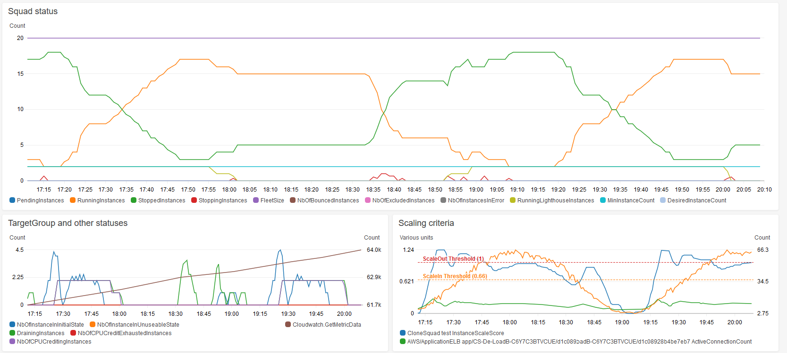

## Welcome to CloneSquad EC2 Pet Autoscaler

> An Autoscaler for mutable architectures on AWS [EC2](https://aws.amazon.com/what-is-cloud-computing/)

Because mutables architectures are still highly common and as they are encountered in most Cloud migrations, CloneSquad is a Serverless Autoscaler software with the main goal to get the most of the [Cloud benefits](https://aws.amazon.com/what-is-cloud-computing/) while taking the constraint
to never create or terminate [EC2](https://aws.amazon.com/ec2/) instances but only by doing start/stop of existing ones (='pet' machines).

> CloneSquad is designed to be used when [AWS Auto Scaling](https://aws.amazon.com/autoscaling/) cannot be: It manages as well EC2 [ALB/NLBs](https://aws.amazon.com/elasticloadbalancing/), target groups and health checks mechanisms. It contains various strategies to reduce cost of running EC2 Pet instance fleets.

> Please visit the [GitHub repository](https://github.com/jcjorel/clonesquad-ec2-pet-autoscaler) for download and instructions

